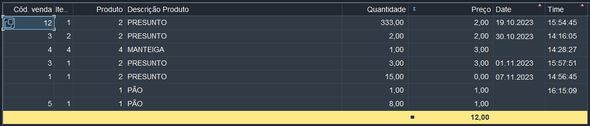

# O ALV é uma ferramenta poderosa para criar listas de uma maneira fácil e prática no ambiente SAP.

Aqui estão alguns pontos importantes do código e um exemplo de como você pode simplificar a criação de uma lista utilizando ALV:

1. **Declarar Tabela Interna e Variáveis:**
   ```ABAP
   TYPES: BEGIN OF we_saida.
   INCLUDE STRUCTURE vbak.
   TYPES: END OF we_saida.

   DATA: wt_saida TYPE STANDARD TABLE OF we_saida WITH HEADER LINE.
   DATA: wv_repid LIKE sy-repid.
   ```

2. **Criar Tela de Parâmetros:**
   ```ABAP
   SELECTION-SCREEN BEGIN OF BLOCK b1 WITH FRAME TITLE text-902.
   SELECT-OPTIONS: s_vbeln FOR wt_saida-vbeln.
   SELECTION-SCREEN END OF BLOCK b1.
   ```

3. **Evento INITIALIZATION:**
   ```ABAP
   INITIALIZATION.
   wv_repid = sy-repid.
   ```

4. **Sub-rotina para Obter Dados da Base de Dados:**
   ```ABAP
   FORM z_buscar_dados.
     PERFORM z_sapgui_progress_indicator USING 'Selecionando dados. Aguarde...'.
     SELECT * INTO TABLE wt_saida FROM vbak WHERE vbeln IN s_vbeln.
   ENDFORM.
   ```

5. **Sub-rotina para Indicador de Progresso:**
   ```ABAP
   FORM z_sapgui_progress_indicator USING pv_text TYPE string.
     CALL FUNCTION 'SAPGUI_PROGRESS_INDICATOR' EXPORTING TEXT = pv_text.
   ENDFORM.
   ```

6. **Sub-rotina para Exibição da Lista com ALV:**
   ```ABAP
   FORM z_list_display.
     PERFORM z_sapgui_progress_indicator USING 'Estruturando a lista. Aguarde...'.
     CALL FUNCTION 'REUSE_ALV_LIST_DISPLAY'
       EXPORTING
         i_callback_program = wv_repid
         it_fieldcat = wt_fieldcat
         i_save = 'A'
       TABLES
         t_outtab = wt_saida
       EXCEPTIONS
         program_error = 1
         others = 2.
     IF sy-subrc NE 0.
       MESSAGE ID sy-msgid TYPE sy-msgty NUMBER sy-msgno
       WITH sy-msgv1 sy-msgv2 sy-msgv3 sy-msgv4.
     ENDIF.
   ENDFORM.
   ```

7. **Sub-rotina para Inicializar Estrutura de Lista:**
   ```ABAP
   FORM z_fieldcat_init USING pt_fieldcat TYPE slis_t_fieldcat_alv.
     DATA: lf_fieldcat TYPE slis_fieldcat_alv.
     CLEAR pt_fieldcat[].
     " Adicione configurações para cada campo da lista
   ENDFORM.
   ```

**Exemplo Simplificado:**
```ABAP
REPORT ZFRA0023_2.

TYPES: BEGIN OF we_saida,
         INCLUDE STRUCTURE vbak,
       END OF we_saida.

DATA: wt_saida TYPE STANDARD TABLE OF we_saida WITH HEADER LINE.

START-OF-SELECTION.
  SELECT * INTO TABLE wt_saida FROM vbak.

  CALL FUNCTION 'REUSE_ALV_LIST_DISPLAY'
    EXPORTING
      i_callback_program = sy-repid
    TABLES
      t_outtab = wt_saida.
```

Este exemplo simplificado realiza a leitura dos dados da tabela `vbak` e exibe uma lista usando a função `REUSE_ALV_LIST_DISPLAY`. Por favor, adapte conforme suas necessidades específicas.

<p align="center">
  
</p>
